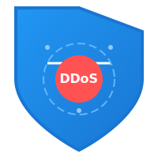
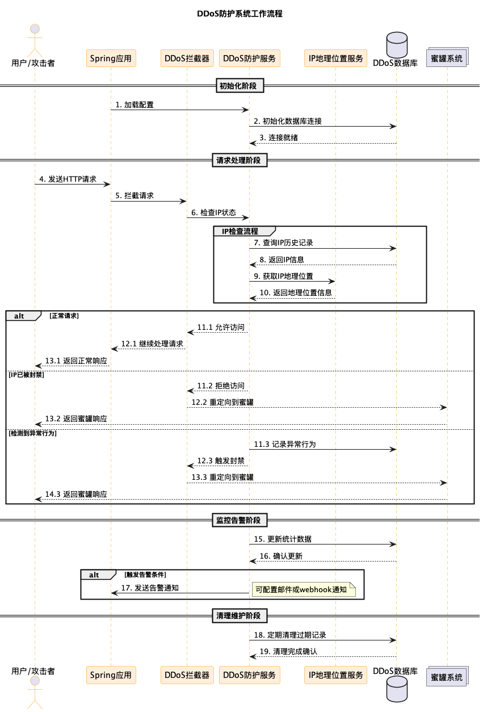

# 🛡️
 Spring Boot DDoS 防护库
<div align="center">
  
</div>

一个企业级的轻量级DDoS防护库，专为Spring Boot应用量身打造。本库采用先进的机器学习算法进行实时流量分析，结合多层防护机制和智能预警系统，为您的应用提供全方位的分布式拒绝服务(DDoS)攻击防护。通过动态流量控制、异常行为识别和自适应防御策略，有效确保应用的稳定运行和服务可用性。支持自定义防护规则、攻击特征识别和防护策略调优，让您的应用在面对各类DDoS攻击时都能从容应对。

## 为什么选择我们？

- 🚀 **即插即用**: 仅需添加依赖和简单配置即可启用
- 🔒 **智能防护**: 自动检测和阻止可疑流量
- 🎯 **精准识别**: 准确区分正常用户和攻击者
- 🌐 **灵活部署**: 支持多种防护策略和配置选项
- 📊 **实时监控**: 提供详细的攻击日志和分析报告

## 主要特性

- 自动识别和过滤恶意流量
- 支持IP白名单和黑名单管理
- 可配置的请求频率限制
- 智能流量重定向机制
- 实时监控和告警系统
- 低资源占用，高性能设计

适用于需要防御DDoS攻击的各类Spring Boot应用，特别推荐给：

- 企业级Web应用
- 电子商务平台
- API服务提供商
- 高流量网站
- 金融科技应用


## 🚀 概述

这是一个专为Spring Boot应用设计的自动DDoS防护库，主要提供以下功能：

- 检测可疑的请求突发
- 将攻击者重定向至蜜罐URL
- 支持多重定向URL，提升防护灵活性
- 智能请求分析与防护

## 📌 安装步骤

### 1️⃣ 添加Maven依赖

在Spring Boot项目的`pom.xml`中添加：

```xml
<dependency>
    <groupId>com.github.ctkqiang</groupId>
    <artifactId>ddos-protection</artifactId>
    <version>1.0.0</version>
</dependency>

````

## ⚙️ 配置说明

在`application.properties`中进行配置：

```properties
# 启用/禁用防护功能
ddos.protection.enabled=true

# 配置蜜罐URL列表
ddos.protection.redirect.urls=http://decoy1.com,http://backup-server.com
```

说明：

- 未配置重定向 URL 时，默认使用`/`（主应用）
- 系统自动保护所有 API 端点

## 🛠️ 运行机制

### 正常用户访问流程

→ 正常访问 API
→ 不受任何影响

### 攻击者处理流程

→ 发送高频请求
→ 超出访问限制
→ 自动重定向至蜜罐 URL
→ 主应用维持正常运行

## ✅ 核心功能

### 自动检测

- 识别来自同一 IP 的高频请求
- 动态阻止过量请求
- 智能重定向攻击流量

### 简单集成

- 仅需添加依赖
- 简单配置即可使用
- 无需修改现有代码

## 🔧 进阶配置

```properties
# 访问频率限制（每分钟请求数）
ddos.protection.rate.limit=100

# IP封禁时长（分钟）
ddos.protection.block.duration=30

# 检测时间窗口（秒）
ddos.protection.window.size=60
```

## 🎯 后续规划

- ✅ IP 白名单管理
- 🚀 基于 AI 的异常检测
- 📊 攻击行为分析
- 🌐 地理位置过滤
- 🔍 深度请求分析
- 📈 实时监控面板

## 📚 使用建议

1. 合理配置请求限制阈值
2. 定期检查防护日志
3. 及时更新白名单配置
4. 监控系统负载情况

## ⚡ 详细工作流程


## 许可证

本项目采用 **木兰宽松许可证 (Mulan PSL)** 进行许可。  
有关详细信息，请参阅 [LICENSE](LICENSE) 文件。  
（魔法契约要保管好哟~）

[](http://license.coscl.org.cn/MulanPSL2)

## 🌟 开源项目赞助计划

### 用捐赠助力发展

感谢您使用本项目！您的支持是开源持续发展的核心动力。  
每一份捐赠都将直接用于：  
✅ 服务器与基础设施维护（魔法城堡的维修费哟~）  
✅ 新功能开发与版本迭代（魔法技能树要升级哒~）  
✅ 文档优化与社区建设（魔法图书馆要扩建呀~）

点滴支持皆能汇聚成海，让我们共同打造更强大的开源工具！  
（小仙子们在向你比心哟~）

---

### 🌐 全球捐赠通道

#### 国内用户

<div align="center" style="margin: 40px 0">

<div align="center">
<table>
<tr>
<td align="center" width="300">

<br />
<strong>🔵 支付宝</strong>（小企鹅在收金币哟~）
</td>
<td align="center" width="300">

<br />
<strong>🟢 微信支付</strong>（小绿龙在收金币哟~）
</td>
</tr>
</table>
</div>
</div>

#### 国际用户

<div align="center" style="margin: 40px 0">
  <a href="https://qr.alipay.com/fkx19369scgxdrkv8mxso92" target="_blank">
    
  </a>
  
  <a href="https://ko-fi.com/F1F5VCZJU" target="_blank">
    
  </a>
  
  <a href="https://www.paypal.com/paypalme/ctkqiang" target="_blank">
    
  </a>
  
  <a href="https://donate.stripe.com/00gg2nefu6TK1LqeUY" target="_blank">
    
  </a>
</div>

---

### 📌 开发者社交图谱

#### 技术交流

<div align="center" style="margin: 20px 0">
  <a href="https://github.com/ctkqiang" target="_blank">
    
  </a>
  
  <a href="https://stackoverflow.com/users/10758321/%e9%92%9f%e6%99%ba%e5%bc%ba" target="_blank">
    
  </a>
  
  <a href="https://www.linkedin.com/in/ctkqiang/" target="_blank">
    
  </a>
</div>

#### 社交互动

<div align="center" style="margin: 20px 0">
  <a href="https://www.instagram.com/ctkqiang" target="_blank">
    
  </a>
  
  <a href="https://twitch.tv/ctkqiang" target="_blank">
    
  </a>
  
  <a href="https://github.com/ctkqiang/ctkqiang/blob/main/assets/IMG_9245.JPG?raw=true" target="_blank">
    
  </a>
</div>

---

🙌 感谢您成为开源社区的重要一员！  
💬 捐赠后欢迎通过社交平台与我联系，您的名字将出现在项目致谢列表！  
（小仙子们在向你撒花哟~）
